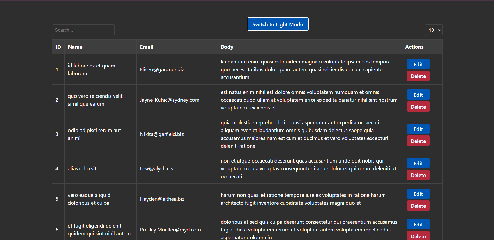

# VUE_JS_Assignment

This project demonstrates a Vue.js application with a datatable component that allows sorting, pagination, and inline editing.

## Features
- Sorting by columns
- Pagination controls
- Inline editing of rows
- Toast notifications on update and delete actions

## Screenshot

## Installation
To run this project, follow these steps:

1. Clone the repository:
   
   git clone https://github.com/it21387494samitha/VUE_JS_Assignment.git

2. cd vue-datatable
3. npm install
4. npm run dev

